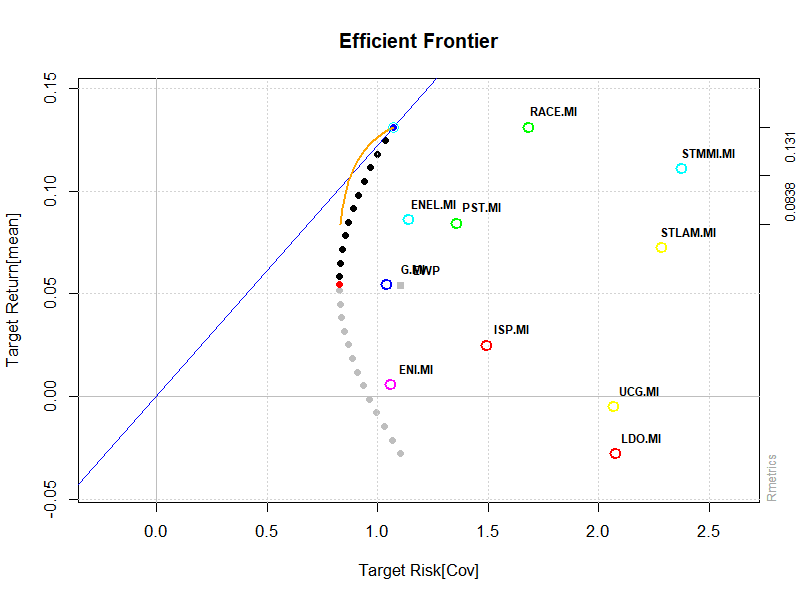
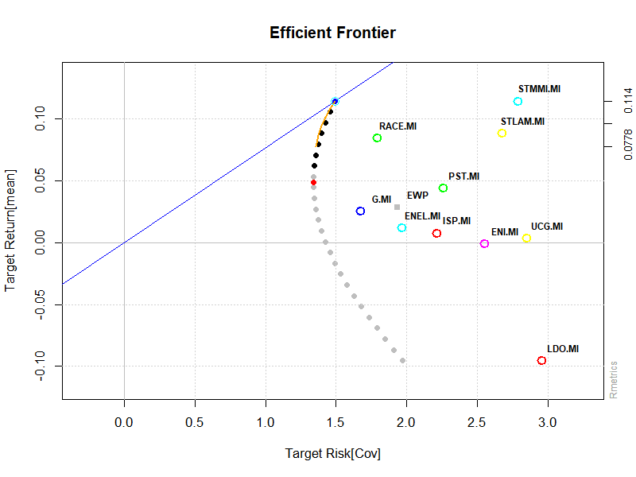
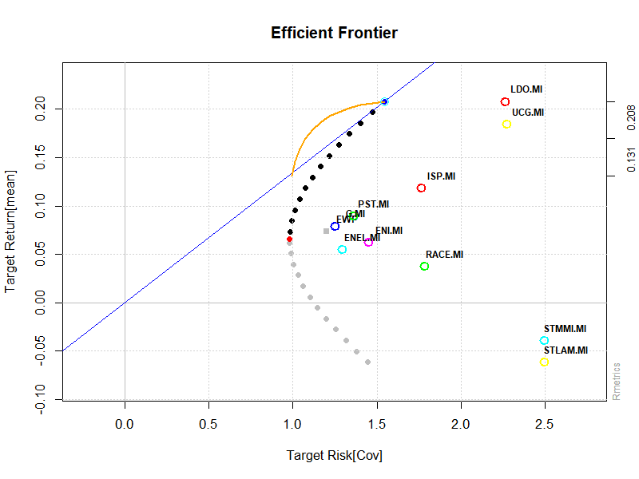
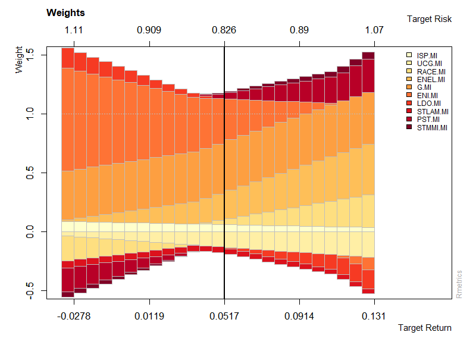
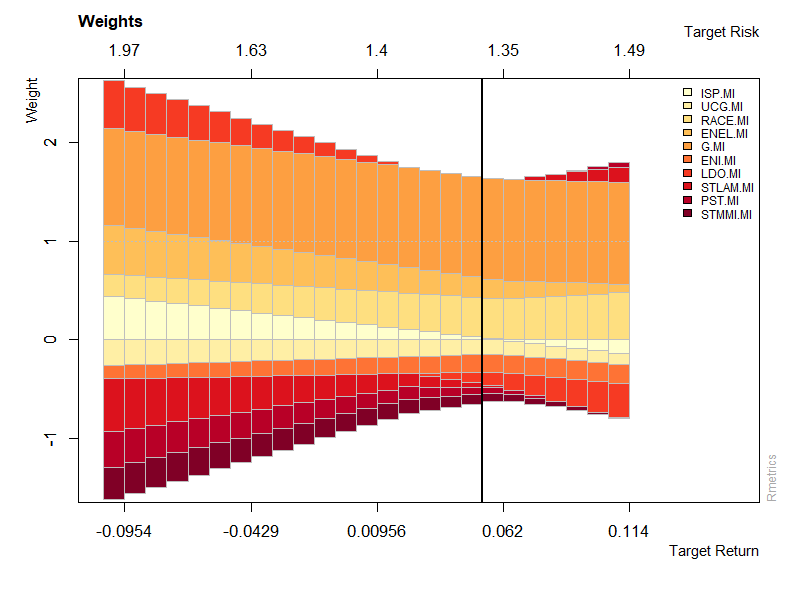
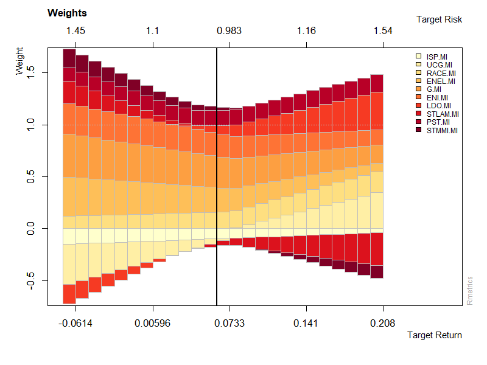

# Portfolio Optimization: A Markowitz Approach on FTSE MIB 🇮🇹

This repository contains the **R implementation** of the **Modern Portfolio Theory (MPT)**, formulated by Harry Markowitz in 1952, applied to a case study of the **FTSE MIB** index. 

The project analyzes portfolio efficiency across three distinct economic periods to evaluate how market dynamics and investment constraints (**Long-Only vs. Short Selling**) affect optimal asset allocation.

---

## Project Overview

The core of this research is the search for an optimal balance between expected return and risk through **diversification**. By analyzing the covariance between assets, the scripts identify the **Efficient Frontier**—the set of portfolios offering the maximum return for a given level of risk.

## Analyzed Periods

The analysis is divided into three R scripts, each covering a specific market phase:

1. **`pre_COVID_analysis.R`**: Baseline market conditions prior to the 2020 pandemic.
2. **`COVID_period_analysis.R`**: Impact of the global pandemic on volatility and asset correlations.
3. **`post_COVID_analysis.R`**: Recent dynamics influenced by geopolitical conflicts and rising inflation.

---

## Key Features

* **Portfolio Types**: Implementation of **Global Minimum Variance Portfolios (MVP)** and **Tangency Portfolios** (maximizing the Sharpe Ratio).
* **Constraint Analysis**: Comparison between **Long-Only** portfolios (no short selling) and **Unlimited Short Selling** scenarios.
* **Risk Management**: Evaluation of risk contributions and **covariance risk budgets**.
* **Visualizations**: Generation of Efficient Frontiers, risk contribution charts, and cumulative return plots.

---

## Visual Analysis

The following analysis illustrates the evolution of the **Efficient Frontier** and the dynamic shift in **Asset Allocation** across different market regimes.

### Efficient Frontiers Comparison
The comparison highlights how market stress (COVID-19) "depresses" the frontier and how the removal of short-selling constraints expands investment opportunities.

| Pre-COVID (Stability) | COVID-19 (Crisis) | Post-War (Recovery) |
|:---:|:---:|:---:|
|  |  |  |
| *Stable trade-off* | *Depressed frontier* | *Increased returns* |

### Portfolio Weights & Asset Allocation
The distribution of weights in the **Tangency Portfolio** shows how the optimal selection of FTSE MIB stocks changes. During turbulence, the model shifts capital toward assets with lower correlation or higher resilience.

| Weights (Pre-COVID) | Weights (COVID) | Weights (Post-War) |
|:---:|:---:|:---:|
|  |  |  |
| *Balanced allocation* | *Crisis-driven shift* | *Inflation-adjusted weights* |

---

## Results & Conclusions

This study demonstrates that the practical effectiveness of the Markowitz model is fundamentally dictated by the non-stationary nature of financial markets. Through the comparative analysis of three distinct economic regimes, it is evident that expected returns, volatility, and correlations are dynamic entities that evolve significantly in response to macroeconomic shifts. Consequently, any static approach to portfolio optimization is destined to yield sub-optimal results, requiring instead a continuous recalibration of input parameters.

A critical finding concerns the impact of investment constraints. While long-only portfolios offer operational simplicity, they inherently limit the diversification potential, especially during high-volatility periods like the one observed in the second interval of this study. The inclusion of short-selling strategies proved capable of significantly expanding the efficient frontier, shifting the risk-return trade-off toward higher returns and lower risk, and transforming potential losses into growth opportunities even in adverse market conditions.

Ultimately, while the Markowitz framework is not a predictive tool for future prices, it remains an indispensable methodology for rational capital allocation. It provides a rigorous discipline for managing the risk-return trade-off and strategically distributing risk contributions. To remain effective in modern finance, the model must be applied with a critical awareness of market dynamism and the structural limitations imposed by investment constraints, ensuring that portfolios are not just theoretically efficient but robust enough to withstand the evolving reality of global markets.

---

## Requirements

To run these scripts, you need **R** and the following packages:
* `fPortfolio` (Rmetrics)
* `quantmod`
* `ggplot2`
* `tidyverse`
* `timeSeries`

## How to Use

1.  **Clone the repository**.
2.  **Create a subfolder** named `/thesis` in the root directory to allow the scripts to save graphical outputs automatically.
3.  **Set the main directory** as your working directory in RStudio.
4.  **Run the scripts** in chronological order to observe the evolution of the FTSE MIB efficiency.

---
**Author:** Damiano Losa  
**Field:** Quantitative Finance / Portfolio Management
